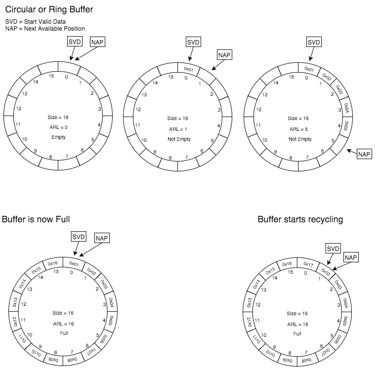
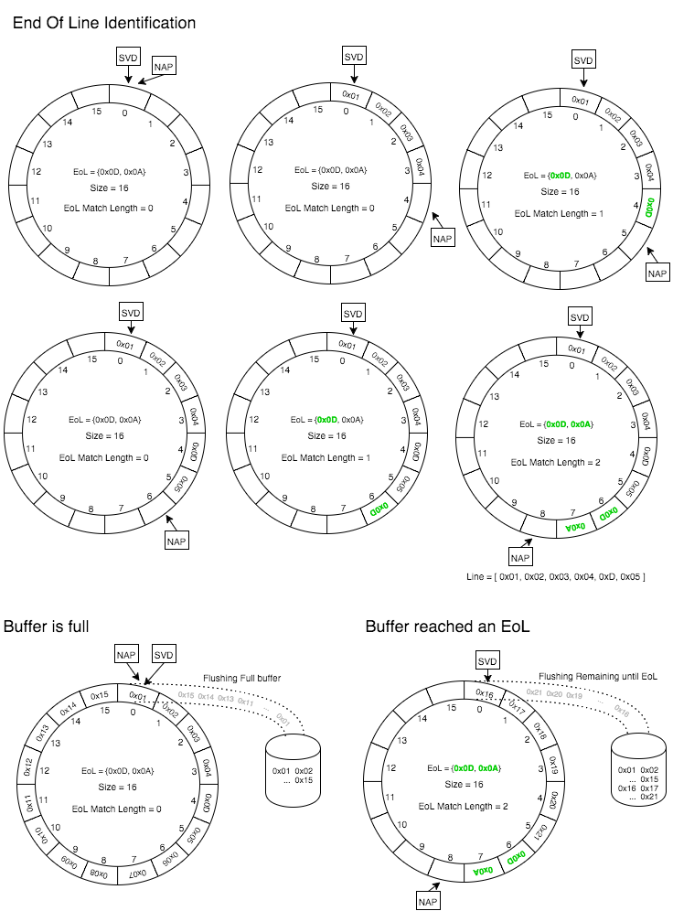
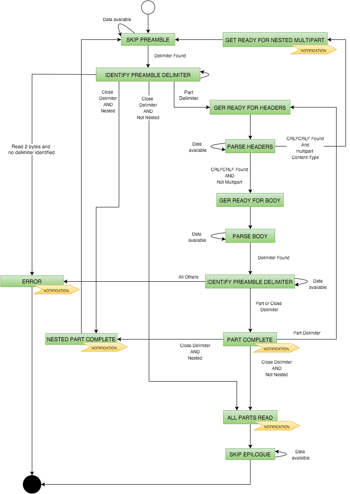
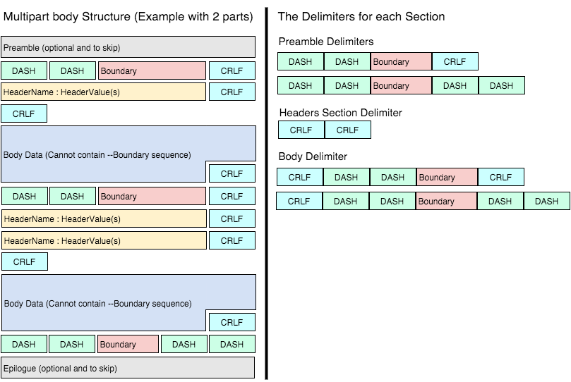

Non-Blocking Multipart parser
=============================

The NIO Multipart project contains a lightweight, generic java library to process multipart requests and responses in a non blocking way and with a configurable, but constant, memory footprint.
It integrates gracefully with the Servlet 3.1 NIO features but it can be easily used in a blocking IO fashion.
The library is intentionally decoupled from the java servlet APIs and it's based on InputStreams and OutputStreams instead.
This makes the library generic and usable for processing not only Http Requests, but also Http responses and potentially other transport protocols.
It is also a good solution for Android given it's reduced dependencies tree.

Requires JDK 1.7 or higher.

Latest release
--------------

The most recent release is nio-multipart 0.0.1.

To add a dependency on NIO Multipart Parser using Maven, use the following:

```xml
<dependency>
  <groupId>com.synchronoss.cloud</groupId>
  <artifactId>nio-multipart-parser</artifactId>
  <version>0.0.1</version>
</dependency>
```

To add a dependency using Gradle:

```
dependencies {
  compile 'com.synchronoss.cloud:nio-multipart-parser:0.0.1'
}
```

Get started
-----------
The simplest way to get started is using the simple fluent API provided with the library. Instantiating a parser is straightforward:

```java
NioMultipartParser parser = newParser(context, listener).forNio();
```

The only two mandatory arguments are a multipart context, holding information about the current request/response, and a listener that will be notified on the progress of the parsing.
The following line shows how a context can be created from an *HttpServletRequest*:

```java
MultipartContext context = MultipartContext(request.getContentType(), request.getContentLength(), request.getCharacterEncoding())
```

The listener is where application logic starts. The parser notifies the client when something happen via several methods defined by the *NioMultipartParserListener* interface.
Clients can decide to inline the definition (like the example below) or create a class that implements the interface. 
What is important is that the client reacts to the events to implement the desired behaviour.
 
```java
NioMultipartParserListener listener = new NioMultipartParserListener() {

    @Override
    public void onPartReady(final PartStreams partStreams, final Map<String, List<String>> headersFromPart) {
        // The parser completed parsing the part. 
        // The parsed headers are available in the headersFromPart map
        // The data can be read from the stream partStreams.getPartInputStream()
    }

    @Override
    public void onNestedPartStarted(final Map<String, List<String>> headersFromParentPart) {
        // The parser identified that the current part contains a nested multipart body
        // The headers are provided in the headersFromParentPart
        // Like for the level 0 parts, the parser will notify the sub parts completion via the methods onPartReady(...) and onFormFieldPartReady(...)
        // When the nested multipart body is finished, the parser will call onNestedPartFinished()
    }

    @Override
    public void onNestedPartFinished() {
        // Called when a nested multipart body has been parsed
    }

    @Override
    public void onFormFieldPartReady(String fieldName, String fieldValue, Map<String, List<String>> headersFromPart) {
        // Called when the part represents a form field.
        // Instead of a PartStreams object, the field name and filedValue are already extracted by the parser and returned to the client.
    }

    @Override
    public void onAllPartsFinished() {
        // Called when the multipart processing finished (encountered the close boundary). No more parts are available!
    }

    @Override
    public void onError(String message, Throwable cause) {
        // An error happened during the parsing.
        // At this point the parser is in an error state and it cannot process any data anymore.
    }
};
```

The final step is to feed the parser with the bytes of the multipart body. In a Servlet 3.1 scenario it could look something like:


```java
final AsyncContext asyncContext = request.startAsync();
final ServletInputStream inputStream = request.getInputStream();

inputStream.setReadListener(new ReadListener() {

    @Override
    public void onDataAvailable() throws IOException {
        int bytesRead;
        byte bytes[] = new byte[1024];
        while (inputStream.isReady()  && (bytesRead = inputStream.read(bytes)) != -1) {
            // Pass the received bytes into the parser. 
            // When something is ready the listener will be called!
            parser.write(bytes, 0, bytesRead);
        }
    }

    @Override
    public void onAllDataRead() throws IOException {
        // NOTE - This method might be called before the parser actually finished the parsing, so parser.close() shouldn't be called without ensuring
        // onAllPartsFinished() or onError() has been called
    }

    @Override
    public void onError(Throwable throwable) {
        // Here the parser should be closed
        parser.close();
    }
});
```

It is important to close the parser if an error happens, if the client decides to stop the processing and if the parsing finishes correctly.

Advanced configuration
----------------------
There are several configuration items that a client can use to tweak or change the parser behaviour:

* Buffer size
* Headers Section max size
* Threshold after which data collected while parsing a part body is flushed to a temporary file 
* Location of the temporary files
* Nested multipart limit

##### Buffer size
The parser to execute its task is using a buffer that by default is 16kb. This buffer has just one requirement: It must be greater than the delimiter + 4.
Every time the buffer is full and it needs to accept more data, it is flushed to an *OutputStream* and in the case of a part body it is usually a *FileOutputStream*.
Increasing the buffer size can reduce the File IO operations.
The recommendation is to stick with the default and adjust it just if it becomes clearly an issue.

##### Headers Section max size
This threshold is a safe-guard to avoid filling the memory if bad clients are sending a header section that is too big.
The parser is reading the entire header section in memory before parsing it and transforming it to a java map.
The headers section max sizes imposes a limit for the size of the headers section and by default is 16kb.
The suggestion is to keep the default value or set it to the value used in the application servers/load balancers used in the production environment.

##### Threshold after which data collected while parsing a part body is flushed to a temporary file
This configuration is only valid if the *DefaultPartStreamsFactory* is used (which is the default choice if the user does not specify an alternative).
The *PartStreamsFactory* is providing to the parser the OutputStream where to flush the part data (part body). 
The *DefaultPartStreamsFactory* is using a "deferred" *FileOutputStream*, where data is kept in memory until a certain threshold is reached.
If the threshold is reached, the memory is cleared and the data is stored into a temporary file.
This approach allows to limit the creation of temporary files (hence disk IO traffic) if the part body is small (for example if it's a form field)
The default value is 10kb and it can be adjusted based on the amount of memory available and/or the traffic model.
If the value is set to 0 (or negative number) it means that no memory will be used and a temporary file will always be created.

##### Location of the temporary files
Like the configuration above, this setting is is only valid if the *DefaultPartStreamsFactory* is used.
By default the temporary files are stored to *${java.io.tmpdir}/nio-file-upload* with a unique name like *nio-body-${uuid}-${part-index}.tmp*.
The path can be changed point to a different location. The folder must be writable otherwise the parser will throw an error.
The *DefaultPartStreamsFactory* is trying to keep the disk usage as low as possible and that's why when a file is read, it is deleted.
In other words, the *onPartReady* event is providing a *PartStreams* that can be used to retrieve the InputStream for the part body.
When the InputStream is closed the underlying file (if any) is deleted.

##### Nested multipart limit
As already mentioned, the parser supports nested multipart bodies. 
This configuration is a safeguard that limits the number of nested multipart bodies that can be processed.
If the limit is reached the parser will finish with an error.
By default is 1 and it is usually sufficient for most of the cases (like http forms with multiple files under the same field).

All the above configurations can be set using the fluent API:

```java
NioMultipartParser parser = newParser(context, listener)
                .withBufferSize(8000)// 8kb
                .withHeadersSizeLimit(8000)// 8kb
                .withMaxMemoryUsagePerBodyPart(0) // Always create a temp file
                .saveTemporaryFilesTo("/tmp/file_upload")// Different temp file location
                .limitNestingPartsTo(2) // Allow two level of nesting
                .forNio();
```

Alternatively the constructors can be used (useful if used along with a dependency injection framework).
It is important to keep in mind that a new parser **MUST** be instantiated per each request/response, so it cannot be mapped as a singleton scoped bean.

A powerful extension point
--------------------------
As mentioned earlier, the parser uses a *PartStreamsFactory* component (by default the *DefaultPartStreamsFactory*).
This factory is responsible of providing *PartStreams* that in turn is providing the *OutputStream* where to store the part body and the *InputStream* from where the body cen be read.
By default the OutputStream is a "deferred" *FileOutputStream*, but clients with specific needs can provide their own implementation.
Suppose that a client wants to store the file directly to a database based on the presence of a specific header.
Well, this is possible defining a custom *PartStreamsFactory*:

```java
public class DBPartStreamFactory extends DefaultPartStreamsFactory{

    @Override
    public PartStreams newPartStreams(Map<String, List<String>> headers, int partIndex) {
        if (MultipartUtils.getHeader("x-store-to-database", headers) != null){

            return new PartStreams() {
                @Override
                public OutputStream getPartOutputStream() {
                    // TODO - Output stream connected to the database
                }

                @Override
                public InputStream getPartInputStream() {
                    // Here return null because there is no need to read the body!
                    return null;
                }
            };

        }else {
            return super.newPartStreams(headers, partIndex);
        }
    };
}
```

The code snipped above is an example of how a customized *PartStreamsFactory*. 
When the parser encounters a part body, it will ask the *PartStreamsFactory* for the *OutputStream* where the data will be written.
In the example if the part header *x-store-to-database* the *OutputStream* will be a channel to the database (and not to a temporary file).
Once the parser finishes processing the part, it will notify passing back the *PartStreams* via the callback *onPartReady*.
The client does not need to read back the data because it's already in the database, so the *getPartInputStream()* method is returning null.

The custom *PartStreamsFactory* can be passed to the parser via the appropriate constructor or using the fluent API (see example)

```java
NioMultipartParser parser = newParser(context, listener)
                .withCustomPartStreamsFactory(dbPartStreamFactory)
                .forNio();
```

This kind of customization can be used to achieve numerous goals. For example it might be possible to compute the file checksum on fly while data are written to the *OutputStream*.
Other scenarios can be the on-fly indexing of the content or metadata extraction.

Nio Multipart Parser - Internal Building Blocks
-----------------------------------------------
This section is mainly for Developers that want to get a more detailed view of the internals of the NIO Multipart parser.
The NIO Multipart Parser is build on top of 3 main building blocks:

* A reusable, fixed-size circular buffer.
* A reusable, fixed size End Of Line Buffer.
* A Final State machine.
 
##### Circular (or Ring) Buffer
A *Circular Buffer* is a data structure where the end of the buffer is connected to the beginning forming a circle. 
When data is read from the buffer there is no need to reshuffle its elements and when the buffer is full (if no action is taken) the oldest bytes are overwritten.
The schema below shows how a *Circular Buffer* works


##### End Of Line Buffer
An *End Of Line Buffer* is built on top of the *Circular Buffer* and at each write it watches for an *End Of Line Sequence*
A few things can happen during a write:

* No End Of Line Sequence is identified and the buffer still has capacity => The data is written to the buffer and a check for the End Of Line Sequence is performed against the new data.
* No End Of Line Sequence is identified, but the buffer is full => Before writing, the buffer data is flushed to an OutputStream. The new data is written and the End Of Line Sequence checking is performed against the new data.
* End Of Line Sequence partially identified and the buffer still has capacity => The data is written to the buffer and a check for the End Of Line Sequence is performed against the new data. 
* End Of Line Sequence partially identified and the buffer is full => Before writing, the buffer data (Excluded the EoL sequence) is flushed to an OutputStream. The new data is written and the End Of Line Sequence checking is continued against the new data.
* If the buffer has a partial match of the EoL and the new data written is not matching the rest of the EoL sequence, the state of the EoL matching is re-set.
* If the buffer has a partial match of the EoL and the new data written matches the rest of the EoL sequence it means that an End Of Line Sequence has been identified. The buffer data (End Of Line Sequence excluded) is flushed to the OutputStream and the buffer is than non writable anymore.

The *End Of Line Buffer* is used by the parser to identify the different sections of the multipart (Preamble, Headers, Body, Epilogue). 
Each of these section is separated by a well defined End Of Line Sequence (e.g. multipart boundary, CRLF).
The Nio Multipart parser is setting up the *End Of Line Buffer* with the correct End Of Line Sequence for the specific section before starting processing the section.

It should be clear now why the buffer size **MUST** always be bigger than the EoL sequence. 
A buffer with not enough capacity for the EoL would end up in a state where the buffer is full but it cannot be flushed because there is a partially matching EoL.

The following diagram shows the *End Of Line Buffer* in action:


##### The Parser Final State Machine
The parsing logic is implemented as a Final State Machine.
While data is written into the parser, the final state machine is executed.
The following diagram shows the states and transitions of the Final State Machine executed by the parser:



In the following schema, the left side is an example of multipart message, while the right side is showing what are the EoL sequences the parser is looking for.


References
----------
[RFC1867](http://www.ietf.org/rfc/rfc1867.txt)

[RFC1521](http://www.ietf.org/rfc/rfc1521.txt)

[RFC1522](http://www.ietf.org/rfc/rfc1522.txt)


